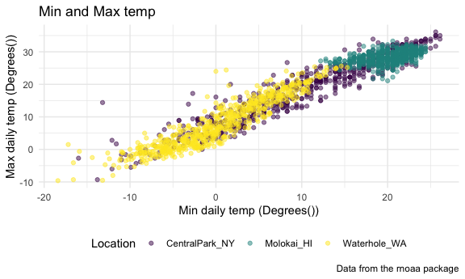
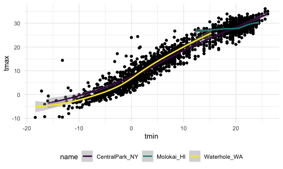
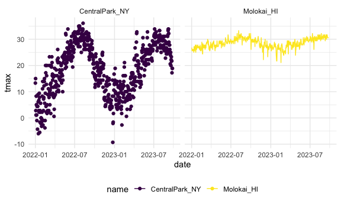
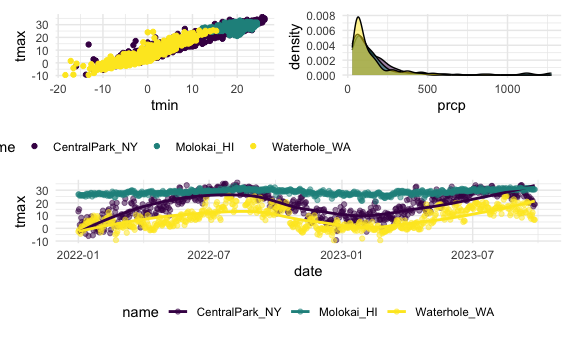

Visualization2
================
Yaduo Wang
2023-10-03

``` r
library(tidyverse)
```

    ## ── Attaching core tidyverse packages ──────────────────────── tidyverse 2.0.0 ──
    ## ✔ dplyr     1.1.3     ✔ readr     2.1.4
    ## ✔ forcats   1.0.0     ✔ stringr   1.5.0
    ## ✔ ggplot2   3.4.3     ✔ tibble    3.2.1
    ## ✔ lubridate 1.9.2     ✔ tidyr     1.3.0
    ## ✔ purrr     1.0.2     
    ## ── Conflicts ────────────────────────────────────────── tidyverse_conflicts() ──
    ## ✖ dplyr::filter() masks stats::filter()
    ## ✖ dplyr::lag()    masks stats::lag()
    ## ℹ Use the conflicted package (<http://conflicted.r-lib.org/>) to force all conflicts to become errors

``` r
library(patchwork)
knitr::opts_chunk$set(
  fig.width = 6,
  fig.asp = .6,
  out.width = "90%"
)

theme_set(theme_minimal() + theme(legend.position = "bottom"))

options(
  ggplot2.continuous.colour = "viridis",
  ggplot2.continuous.fill = "viridis"
)

scale_colour_discrete = scale_colour_viridis_d
scale_fill_discrete = scale_fill_viridis_d
```

``` r
weather_df = 
  rnoaa::meteo_pull_monitors(
    c("USW00094728", "USW00022534", "USS0023B17S"),
    var = c("PRCP", "TMIN", "TMAX"), 
    date_min = "2022-01-01",
    date_max = "2023-12-31") |>
  mutate(
    name = recode(
      id, 
      USW00094728 = "CentralPark_NY", 
      USW00022534 = "Molokai_HI",
      USS0023B17S = "Waterhole_WA"),
    tmin = tmin / 10,
    tmax = tmax / 10) |>
  select(name, id, everything())
```

    ## using cached file: /Users/wangyaduo/Library/Caches/org.R-project.R/R/rnoaa/noaa_ghcnd/USW00094728.dly

    ## date created (size, mb): 2023-09-28 10:18:37.969631 (8.524)

    ## file min/max dates: 1869-01-01 / 2023-09-30

    ## using cached file: /Users/wangyaduo/Library/Caches/org.R-project.R/R/rnoaa/noaa_ghcnd/USW00022534.dly

    ## date created (size, mb): 2023-09-28 10:18:47.438284 (3.83)

    ## file min/max dates: 1949-10-01 / 2023-09-30

    ## using cached file: /Users/wangyaduo/Library/Caches/org.R-project.R/R/rnoaa/noaa_ghcnd/USS0023B17S.dly

    ## date created (size, mb): 2023-09-28 10:18:50.692538 (0.994)

    ## file min/max dates: 1999-09-01 / 2023-09-30

``` r
weather_df
```

    ## # A tibble: 1,914 × 6
    ##    name           id          date        prcp  tmax  tmin
    ##    <chr>          <chr>       <date>     <dbl> <dbl> <dbl>
    ##  1 CentralPark_NY USW00094728 2022-01-01   201  13.3  10  
    ##  2 CentralPark_NY USW00094728 2022-01-02    10  15     2.8
    ##  3 CentralPark_NY USW00094728 2022-01-03     0   2.8  -5.5
    ##  4 CentralPark_NY USW00094728 2022-01-04     0   1.1  -7.1
    ##  5 CentralPark_NY USW00094728 2022-01-05    58   8.3  -0.5
    ##  6 CentralPark_NY USW00094728 2022-01-06     0   5     1.1
    ##  7 CentralPark_NY USW00094728 2022-01-07    97   1.1  -3.8
    ##  8 CentralPark_NY USW00094728 2022-01-08     0  -1    -6.6
    ##  9 CentralPark_NY USW00094728 2022-01-09    25   4.4  -1.6
    ## 10 CentralPark_NY USW00094728 2022-01-10     0   4.4  -4.3
    ## # ℹ 1,904 more rows

``` r
weather_df |> 
  ggplot(aes(x=tmin,y=tmax))+
  geom_point(aes(color = name), alpha = .5)+
  labs(
    x = "Min daily temp (Degrees())",
    y = "Max daily temp (Degrees())",
    color = "Location",
    title = "Min and Max temp",
    caption = "Data from the rnoaa package")+
  scale_x_continuous(
    breaks = c(-15, 0, 15),
    labels = c("-15 C", "0", "15"))+
  scale_y_continuous(
    position = "right", 
    limits = c(0,30))+
  viridis::scale_color_viridis(
    name = "Location", 
    discrete = TRUE
  )
```

    ## Warning: Removed 322 rows containing missing values (`geom_point()`).


\#Theme

``` r
weather_df |> 
  ggplot(aes(x=tmin,y=tmax))+
  geom_point(aes(color = name), alpha = .5)+
  labs(
    x = "Min daily temp (Degrees())",
    y = "Max daily temp (Degrees())",
    color = "Location",
    title = "Min and Max temp",
    caption = "Data from the rnoaa package")+
  viridis::scale_color_viridis(
    discrete = TRUE
  )+
  theme_minimal()+
  theme(legend.position = "bottom")
```

    ## Warning: Removed 30 rows containing missing values (`geom_point()`).



``` r
weather_df |> 
  ggplot(aes(x=tmin,y=tmax))+
  geom_point()+
  geom_smooth(aes(color = name))
```

    ## `geom_smooth()` using method = 'loess' and formula = 'y ~ x'

    ## Warning: Removed 30 rows containing non-finite values (`stat_smooth()`).

    ## Warning: Removed 30 rows containing missing values (`geom_point()`).



``` r
nyc_weather_df = 
  weather_df |> 
  filter(name == "CentralPark_NY")

hawaii_weather_df = 
  weather_df |> 
  filter(name == "Molokai_HI")

ggplot(nyc_weather_df, aes(x = date, y = tmax, color = name)) + 
  geom_point() + 
  geom_line(data = hawaii_weather_df)+
  facet_grid(~name)
```

    ## Warning: Removed 5 rows containing missing values (`geom_point()`).

    ## Warning: Removed 5 rows containing missing values (`geom_line()`).



``` r
ggp_temp_scatter = 
  weather_df |> 
  ggplot(aes(x=tmin,y=tmax, color = name))+
  geom_point()

ggp_prep_weather = 
  weather_df |> 
  filter(prcp > 25) |> 
  ggplot(aes(x = prcp, fill = name)) + 
  geom_density(alpha = .5) + 
  theme(legend.position = "none")

tmax_date_p = 
  weather_df |> 
  ggplot(aes(x = date, y = tmax, color = name)) + 
  geom_point(alpha = .5) +
  geom_smooth(se = FALSE) + 
  theme(legend.position = "bottom")
  
(ggp_temp_scatter + ggp_prep_weather)/ tmax_date_p
```

    ## Warning: Removed 30 rows containing missing values (`geom_point()`).

    ## `geom_smooth()` using method = 'loess' and formula = 'y ~ x'

    ## Warning: Removed 30 rows containing non-finite values (`stat_smooth()`).
    ## Removed 30 rows containing missing values (`geom_point()`).



``` r
weather_df |> 
  mutate(
    name = fct_relevel(name, c("Molokai_HI", "CentralPark_NY", "Waterhole_WA"))
  ) |> 
  ggplot(aes(x = name, y = tmax, color = name))+
  geom_boxplot()
```

    ## Warning: Removed 30 rows containing non-finite values (`stat_boxplot()`).


``` r
weather_df |> 
  mutate(
    name = fct_reorder(name, tmax)) |> 
  ggplot(aes(x = name, y = tmax, fill = name))+
  geom_violin()
```

    ## Warning: There was 1 warning in `mutate()`.
    ## ℹ In argument: `name = fct_reorder(name, tmax)`.
    ## Caused by warning:
    ## ! `fct_reorder()` removing 30 missing values.
    ## ℹ Use `.na_rm = TRUE` to silence this message.
    ## ℹ Use `.na_rm = FALSE` to preserve NAs.

    ## Warning: Removed 30 rows containing non-finite values (`stat_ydensity()`).


``` r
pup_data = 
  read_csv("FAS_pups.csv") |>
  janitor::clean_names() |>
  mutate(
    sex = 
      case_match(
        sex, 
        1 ~ "male", 
        2 ~ "female"))
```

    ## Rows: 313 Columns: 6
    ## ── Column specification ────────────────────────────────────────────────────────
    ## Delimiter: ","
    ## chr (1): Litter Number
    ## dbl (5): Sex, PD ears, PD eyes, PD pivot, PD walk
    ## 
    ## ℹ Use `spec()` to retrieve the full column specification for this data.
    ## ℹ Specify the column types or set `show_col_types = FALSE` to quiet this message.

``` r
litter_data = 
  read_csv("FAS_litters.csv") |>
  janitor::clean_names() |>
  separate(group, into = c("dose", "day_of_tx"), sep = 3)
```

    ## Rows: 49 Columns: 8
    ## ── Column specification ────────────────────────────────────────────────────────
    ## Delimiter: ","
    ## chr (2): Group, Litter Number
    ## dbl (6): GD0 weight, GD18 weight, GD of Birth, Pups born alive, Pups dead @ ...
    ## 
    ## ℹ Use `spec()` to retrieve the full column specification for this data.
    ## ℹ Specify the column types or set `show_col_types = FALSE` to quiet this message.

``` r
fas_data = left_join(pup_data, litter_data, by = "litter_number") 

fas_data |> 
  select(sex, dose, day_of_tx, pd_ears:pd_walk) |> 
  pivot_longer(
    pd_ears:pd_walk,
    names_to = "outcome", 
    values_to = "pn_day") |> 
  drop_na() |> 
  mutate(outcome = fct_reorder(outcome, pn_day)) |> 
  ggplot(aes(x = dose, y = pn_day)) + 
  geom_violin() +
  facet_grid(day_of_tx ~ outcome)
```


